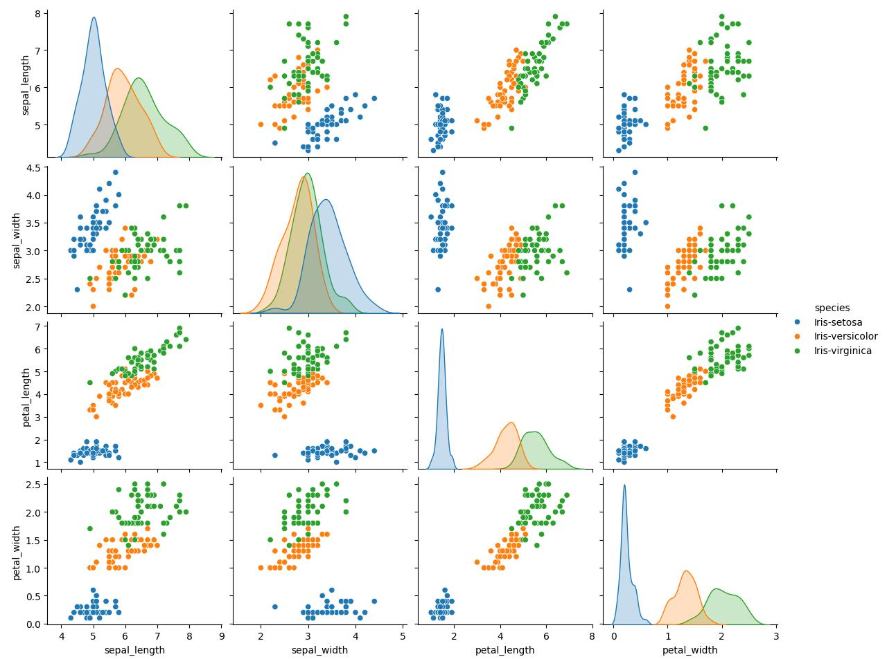
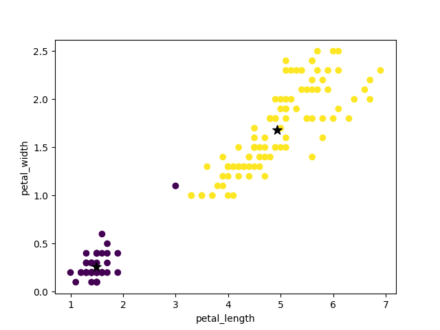
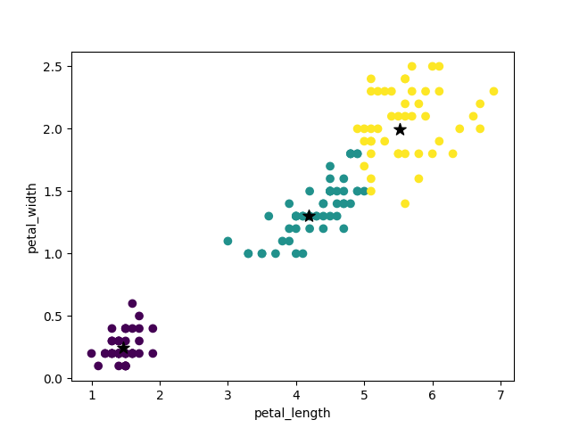
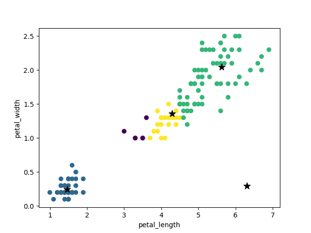
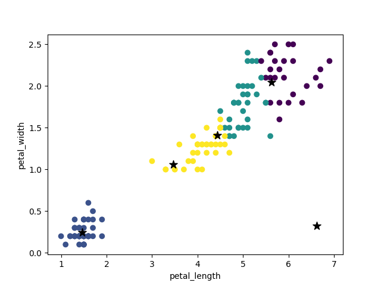
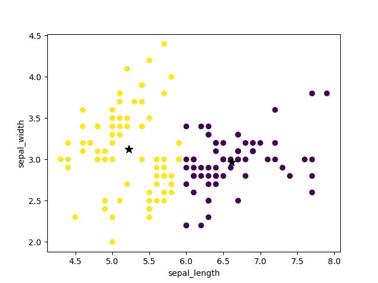
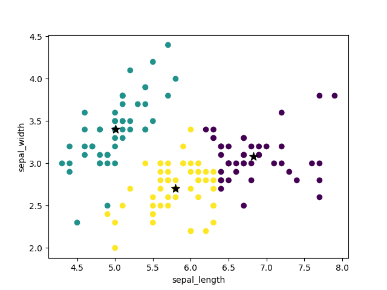
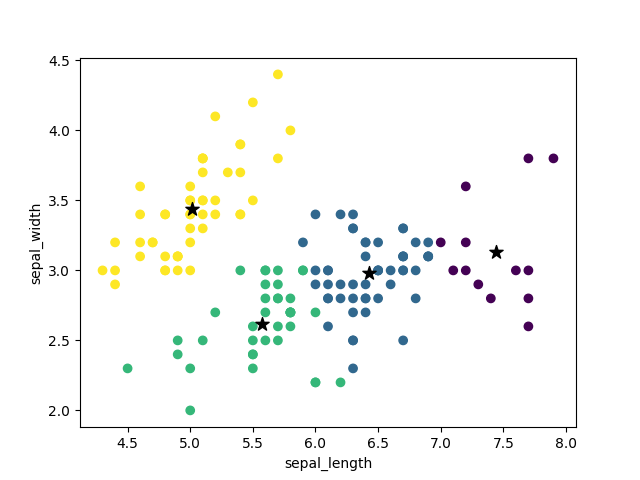
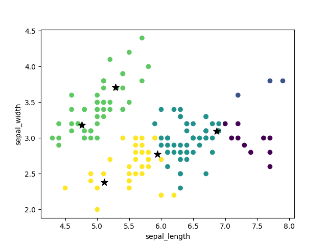
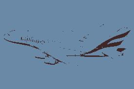

# Informe - Proyecto 3 

## Parte 1 - Implementación del algoritmo de K-Means

Se realizó la implementación usando las librerías de `numpy` y siguiendo el esquema sugerido por NeuralNine en su canal https://www.youtube.com/watch?v=5w5iUbTlpMQ.

La implementación del algoritmo incluye únicamente dos métodos, los de `inicializarCentroides` y `distanciaEuclideana`. El primero, es el que realiza todo el cálculo de centroides, así como inicializarlos y la condición de parada del algoritmo.

Se consideran que con 200 iteraciones el algoritmo ya obtuvo los `k` centroides o cuando la distancia euclideana entre el centroide antiguo y el actual es menor a `0.0001`.

## Parte 2 - Análisis del Iris Dataset

El objetivo de este análisis es observar si el algoritmo de k-means realiza una clasificación correcta de las plantas basándose en los parámetros dados en el dataset.

Se tienen los siguientes parámetros para realizar una clasificación:

- Ancho del pétalo
- Largo del pétalo
- Largo del sépalo
- Ancho del sépalo

El algoritmo de k-means propone correctamente centroides para clasificar a las plantas, sin embargo, dicha clasificación es incorrecta. Podemos analizar los datos se la siguiente manera.

Se consideran las permutaciones de los 4 clasificadores como posibles gráficos, esto es:

- Ancho del pétalo, Largo del sépalo
- Ancho del pétalo, Largo del pétalo
- Ancho del pétalo, Ancho del sépalo
- Largo del pétalo, Largo del sépalo
- Largo del pétalo, Ancho del pétalo
- Largo del pétalo, Ancho del sépalo
- Ancho del sépalo, Largo del sépalo
- Ancho del sépalo, Largo del pétalo
- Ancho del sépalo, Ancho del pétalo
- Largo del sépalo, Largo del pétalo
- Largo del sépalo, Ancho del pétalo
- Largo del sépalo, Ancho del sépalo

La clasificación original, esto es, sin K-means y usando los datos originales del .csv, con cada permutación mencionada se observa a continuación:

Se seleccionaron los valores de $k = [2,3,4,5]$. En teoría, el mejor clasificador debería ser el $k=3$ debido a que sabemos que hay son 3 tipos de plantas, mientras que los demás valores de $k$ no deberían clasificar corectamente al tener más o menos categorías.

El hecho que se tengan menos categorías no significa que no sea posible obtener una certeza, ya que por ejemplo las plantas _Iris Versicolor_ e _Iris Virginica_ se sobreponenen en ciertas zonas, así que considerarlas como una sola clasificación como las _Iris V_ y las _Iris Setosa_ por otro lado puede crear una buena clasificación.

Debido a la gran cantidad de gráficos se analizaran unos pocos.

Veamos por ejemplo el caso _Largo del pétalo, Ancho del pétalo_

En este gráfico, podemos ver que si se consideran a las _Iris Setosa_ como las de color púrpura y a las _Iris V_ como las amarillas, la clasificación fue exitosa, a excepción de un punto irregular cerca de las _Iris V_.

Con $k=3$ se puede tener una mejor certeza de cuáles son _Iris Virginica_ y cuáles son _Iris Versicolor_, sin embargo, aún hay solapamiento debido a la cercanía de estos valores.

Para $k=4$ y $k=5$ dan clasificaciones sin sentido.

|$k=4$|$k=5$
--|--|
|

A continuación consideremos el caso _Ancho del sépalo, Largo del sépalo_

En este caso, si se considera a las amarillas como las _Iris Setosa_ y las moradas como las _Iris V_, la clasificación no es correcta ya que hay un grupo clasificado como _Iris Setosa_ cuando realmente son _Iris V_

El caso con $k=3$ arroja realmente un resultado más acertado de la realidad:

Para $k=4$ y $k=5$ da valores sin sentido.

|$k=4$|$k=5$
--|--|
||

De estas observaciones, puede notarse que usar k-means para este conjunto de datos no es idóneo, aún cuando hayan aciertos, no se tiene una garantía de que los datos estén correctamente clasificados.

Igualmente, el uso de valores de $k$ mayores a 3 ocasiona que la clasificación no tenga sentido. 

Todo esto se menciona porque se tiene conocimiento del conjunto de datos.

## Parte 3 - Segmentación de Imágenes

Aprovechando las facilidades de los K-means, es posible segmentar las imágenes en `k` colores. Esta herramienta puede ser usada en la compresión de imágenes, al reducir la cantidad de colores que posee.

Se seleccionaron las siguientes dos imágenes para su análisis:

||

A fin de tener una comparativa visual de diferente cantidad de colores se usaron los valores de $k=[2,4,8,16,32,64,128,256]$.

Se tienen las siguientes imágenes para la primera imagen:

|2|4|8|16|
--|--|--|--|
||||

|32|64|128|256|
--|--|--|--|
||||

Para la segunda imagen se obtuvieron las siguientes imágenes:

|2|4|8|16|
|--|--|--|--|
||||

|32|64|128|256|
--|--|--|--|
|||

Debido a la predominancia del azul en la imagen original, casi no son perceptibles los cambios entre $k=8$ y $k=16$.

Para ambos casos, las diferencias entre $k=128$ y $k=256$ podrían resultar imperceptibles, e inclusive, el tamaño del archivo podría ser menor.

Se notó que para el primer archivo, `a380.jpeg`, todas las imágenes pesaban menos que la imagen original, sin embargo, la diferencia de tamaño entre $k=32$ a $k=256$ es mínima.

Para el segundo archivo `genshin.jpeg`, ocurrió lo contrario. Hay casos donde la imagen nueva pesa más que la imagen original, presumimos esto se debe a la calidad de la imagen original y que la nueva podría estar añadiendo más colores.
